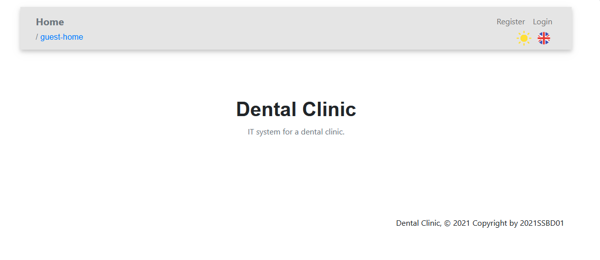
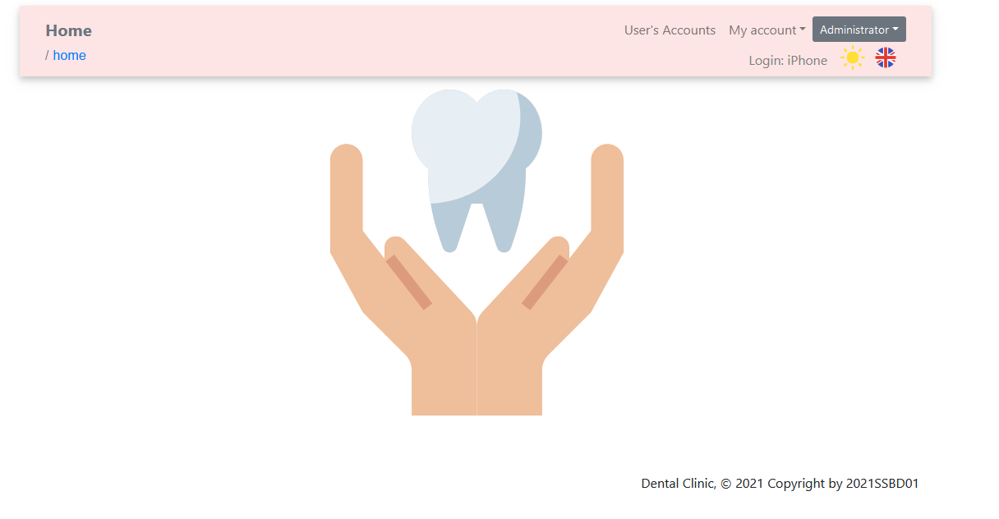

<h1 align="center">Dental Clinic</h1>
<div align="center">

[]()

</div>

## 📝 Table of Contents

- [📝 Table of Contents](#-table-of-contents)
- [🧐 About <a name = "about"></a>](#-about-)
- [🔑 Prerequisites <a name = "prerequisites"></a>](#-prerequisites-)
- [⛏️ Built Using <a name = "built_using"></a>](#️-built-using-)
- [✍️ Authors <a name = "authors"></a>](#️-authors-)

## 🧐 About <a name = "about"></a>

The repository contains a fullstack Java/JS web application that is intended to be used by a dental clinic. 

<p align="center">
    <a href="https://www.youtube.com/watch?v=UQWVD_xorck">
    Application Showcase :poland:
    </a>
</p>
<p align="center">
    
</p>
    </br>
    </br>
<p align="center">
    
</p>
    </br>
    </br>
<p style="" align="center">
    
</p>

## 🔑 Prerequisites <a name = "prerequisites"></a>

The application requires deployment to an application server, [Payara Server 5.2021.1](https://www.payara.fish/) was used in developement. In order to deploy the application run mvn:install to generate the war file. The war file is then ready for deployment.

In order to run the application you will need to configure the application.properties file in the resources folder with the file structure shown in the example below:

```
account.confirmation.jwt.secret=TODO
unlock.by.mail.confirmation.jwt.secret=TODO

(...)

mail.smtp.ssl.trust=TODO
```

You will also need to edit the JDBCConfig.java file found in the config package by supplying it with the correct url's and passwords for the data sources. An example datasource is shown below:

```
@DataSourceDefinition(
        name = "java:app/jdbc/ssbd01mok",
        className = "org.postgresql.ds.PGSimpleDataSource",
        user = "ssbd01mok",
        password = "TODO",
        serverName = "TODO",
        portNumber = 5432,
        databaseName = "ssbd01",
        transactional = true,
        initialPoolSize = 1,
        minPoolSize = 0,
        maxPoolSize = 32,
        isolationLevel = Connection.TRANSACTION_READ_COMMITTED)
```

Use the sql scripts found in resources/META-INF/sql to populate your database with sample data.

## ⛏️ Built Using <a name = "built_using"></a>

- [Java](www.java.com)
- [Apache Maven](www.maven.apache.org)
- [JavaEE 8](https://www.oracle.com/java/technologies/java-ee-8.html)
- [React.js](https://reactjs.org/)
- [PostgreSQL](https://www.postgresql.org/)
- [Hibernate](https://hibernate.org/)

## ✍️ Authors <a name = "authors"></a>

* [Przemysław Zdrzalik](https://github.com/ZdrzalikPrzemyslaw)
* [Julia Szymańska](https://github.com/JuliaSzymanska)
* [Grzegorz Muszyński](https://github.com/szerszen199)
* [Witold Pietrzak](https://github.com/WitoldPietrzak)
* [Piotr Antczak](https://github.com/pantczak)
* Bartłomiej Graczyk
* Tomasz Woźniak
